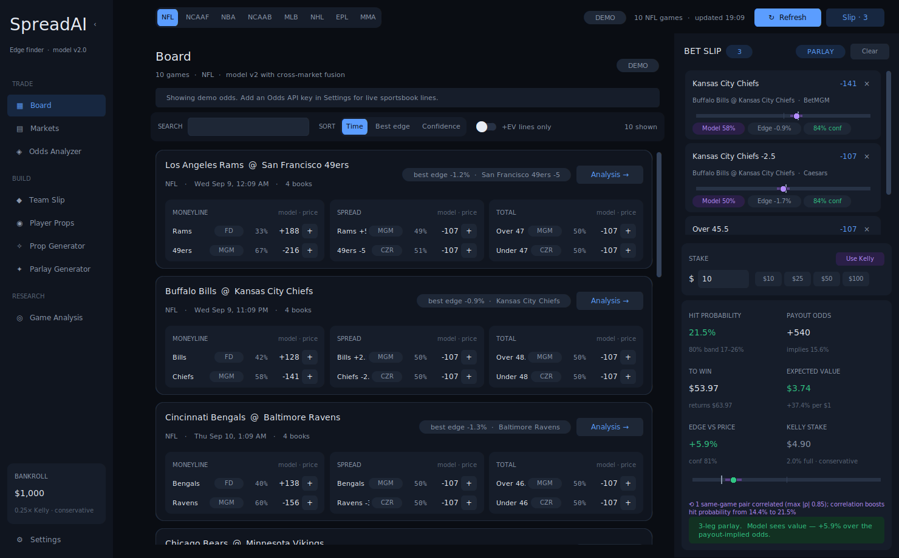
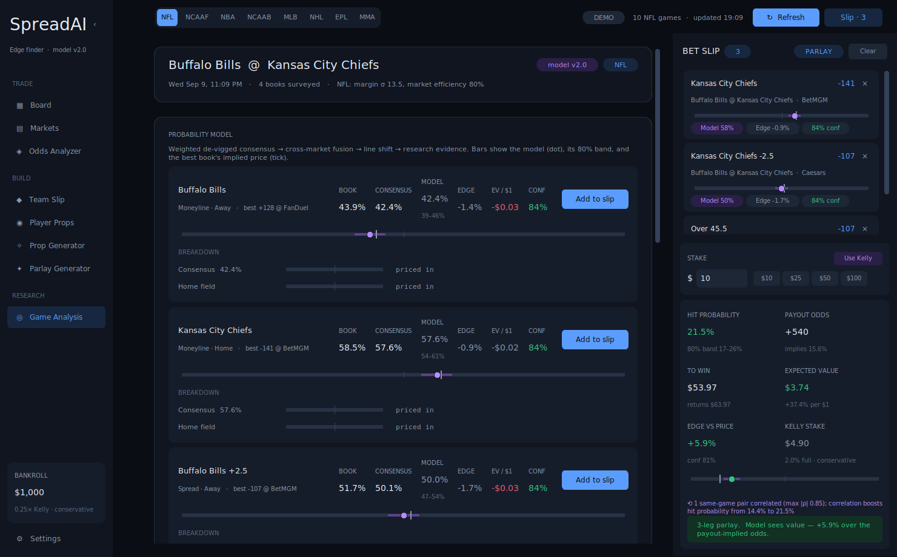

# SpreadAI

Desktop sports-betting edge finder. SpreadAI pulls sportsbook markets, DFS
projections and public team/player data, prices every selection with an
explainable probability model, and lets you build slips with
correlation-aware parlay math.



## What it does

| Screen | Purpose |
| --- | --- |
| **Board** | Every game with the best price, model probability and edge per line. Search, sort by edge/confidence, +EV filter. |
| **Markets** | Line shop: every book's price on every market, side by side, with the sharpness-weighted consensus. |
| **Odds Analyzer** | Cross-book scanners: +EV picks, two-way arbitrage with stake split, biggest line spreads. |
| **Team Slip** | PrizePicks / Underdog / Kalshi team pick-em tiles priced by the model. |
| **Player Props** | PrizePicks projections modeled against recent player history, with sample sparklines. |
| **Prop Generator / Parlay Generator** | Auto-build slips in three styles, multiple slips at once, single-book slips. |
| **Game Analysis** | Team research (form, injuries, rest, head-to-head), a per-market model breakdown, news. |
| **Bet slip** | Legs with probability bars and 80 % bands, Kelly sizing, parlay / power-play / Kalshi math, same-game correlation note. |

## The model (v2)

Every team-market probability is built the same way and every step is shown
in the UI:

1. **Per-book de-vig** — power method for moneylines, multiplicative for
   spreads/totals; only books at the consensus line vote on price.
2. **Sharpness-weighted consensus** in logit space (Pinnacle > DK/FD > offshore).
3. **Cross-market fusion** — the moneyline and the spread are two views of the
   same margin distribution; a normal margin model with a sport-specific σ
   converts one into the other and the two are fused by inverse variance.
4. **Line shift** — if the best price sits on a different line than the
   consensus, the prior is moved through the same margin model.
5. **Research evidence** — injuries, form vs baseline, rest, head-to-head as
   signed, confidence-weighted evidence in logit space, discounted by the
   sport's market efficiency and soft-capped.
6. **Uncertainty** — an 80 % interval and a confidence score; Kelly stakes
   default to the interval's low end.

Player props use recency-weighted samples shrunk toward the posted line, a
distribution chosen by the stat's shape (normal / Poisson / negative
binomial) and an empirical hit-rate blend. Parlays use a Gaussian copula so
same-game legs are correlated instead of multiplied.

See [docs/SYSTEM_DESIGN.md](docs/SYSTEM_DESIGN.md) for the full design.



## Run it

```
pip install -r requirements.txt
python main.py
```

On Windows, `run.bat` creates a virtual environment, installs dependencies
and launches the app.

Without an Odds API key the app runs on a built-in demo slate. Add a free key
from [the-odds-api.com](https://the-odds-api.com/) in **Settings** for live
lines. PrizePicks/Underdog projections and ESPN research need no key.

Keyboard: `Ctrl+R` refresh · `Ctrl+B` toggle slip · `Ctrl+[` collapse sidebar
· `Ctrl+1…8` switch views · `Ctrl+,` settings.

## Tests

```
python -m pytest tests -q
```

The suite covers the probability engine, the leg/parlay layer and both
generators, entirely offline.

## Layout

```
main.py                 entry point
src/ui/                 shell, theme tokens, widget kit, views
src/analysis/model.py   probability engine
src/analysis/           leg/parlay/prop layers, research, generators, market scanners
src/api/                The Odds API, ESPN, PrizePicks, Underdog clients + demo slates
src/utils/              config + cache storage, odds formatting
tests/                  pytest suite
docs/                   system design, screenshots
```

For entertainment and research only. Bet responsibly.
