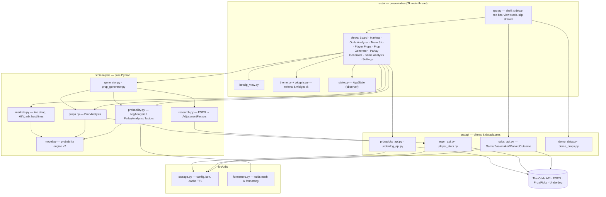
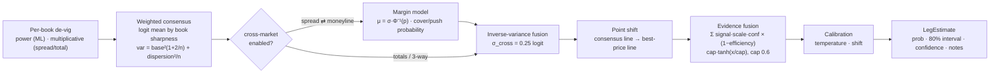

# SpreadAI — System Design

SpreadAI is a desktop sports-betting edge finder. It pulls sportsbook markets,
DFS projections and public team/player data, prices every selection with an
explainable probability model, and lets the user build slips with
correlation-aware parlay math. This document lays out how the system is put
together: the layers, the data flow, the concurrency and caching rules, the
probability engine, and where to extend it.

* **Runtime:** Python 3.10+, Tk/CustomTkinter, `requests`. Single process, one
  UI thread, short-lived worker threads for I/O.
* **Persistence:** `config.json` (user settings) and `.cache/*.json` (TTL'd API
  responses). No database.
* **External services:** The Odds API (sportsbook prices), ESPN site API (team
  form, injuries, schedules, rosters, game logs, news), PrizePicks and Underdog
  (DFS projections). All optional — every screen works offline on the demo
  slate.

---

## 1. Design principles

1. **Explainable probabilities.** Every number the UI shows can be traced:
   consensus → cross-market check → line shift → research evidence → interval.
   `LegAnalysis.notes` carries that trace and the UI renders it as tooltips and
   breakdown bars.
2. **Market first, research second.** Sportsbook lines are the prior. Research
   (injuries, form, rest, head-to-head) nudges the prior in logit space and is
   discounted by how efficient the market is for that sport. Nothing that is
   already priced into a line (home field) is double counted.
3. **Pure analysis, thin UI.** `src/analysis` is pure Python over dataclasses:
   no widgets, no threads, no network calls except the explicit research
   fetchers. It is unit-tested in isolation (`tests/`).
4. **The UI thread owns the widgets.** Network work runs on daemon threads and
   results are marshalled back through one queue (`runtime.ui_call`) that the
   Tk main loop drains; workers never touch Tk.
5. **Degrade gracefully.** Missing key → demo odds. Feed down → demo props.
   Research fetch fails → empty research, the market prior still prices the
   leg.

---

## 2. Architecture



**Dependency rule:** arrows only point downward. `src/ui` imports
`src/analysis` and `src/api`; `src/analysis` imports `src/api` dataclasses and
`src/utils`; `src/api` imports only `src/utils`. `model.py` is the one place
probabilities are *estimated*; everything above it shapes the result for a
caller.

### 2.1 Module map

| Module | Responsibility | Key symbols |
| --- | --- | --- |
| `main.py` | Entry point; friendly failure if CustomTkinter is missing | `main()` |
| `src/ui/app.py` | Root window, grouped sidebar (collapsible), top command bar (sport picker, LIVE/DEMO pill, refresh, slip toggle), view stack, keyboard shortcuts, 60 s auto-refresh, config → model settings | `App`, `NAV_GROUPS`, `AUTO_REFRESH_MS` |
| `src/ui/theme.py` | Design tokens: palette (strong/soft semantic pairs), type scale, spacing, radii, layout metrics, color helpers | `ACCENT`, `MODEL`, `edge_color()`, `variant_colors()` |
| `src/ui/widgets.py` | Widget kit: `Card`, `Pill`, `StatBlock`, `Segmented`, `PageHeader` (title + source pill + banner), `Toolbar`, `EmptyState`, `Tooltip`, canvas visuals `ProbBar`, `FactorBar`, `Sparkline`, themed `ttk.Treeview` via `make_tree()` | |
| `src/ui/state.py` | Shared state + observer bus | `AppState.subscribe/notify`, `add_leg/remove_leg/clear_slip` |
| `src/ui/games_view.py` | Board: per-game cards, best price + model % + edge per line, search/sort/+EV filter | `GamesView`, `GameCard` |
| `src/ui/markets_view.py` | Line shop: every book's price per selection | `GameMarketsCard` |
| `src/ui/analyzer_view.py` | Cross-book scanners: +EV, arbitrage (with stake split), best lines | `AnalyzerView` |
| `src/ui/team_slip_view.py` | PrizePicks/Underdog/Kalshi team pick-em tiles with model probability | `PickTile` |
| `src/ui/props_view.py` | Player-prop table (virtualized), sample sparkline, add Over/Under | `PropsView` |
| `src/ui/prop_generator_view.py` / `generator_view.py` | Slip generators (mode, legs, multi-slip, dedup, book filter) | |
| `src/ui/analysis_view.py` | Game research + per-market model breakdown + news | `MarketRow` |
| `src/ui/betslip_view.py` | Slip drawer: legs with probability bars, stake, Kelly, parlay/power-play/Kalshi math, correlation note, verdict | `BetSlipPanel` |
| `src/ui/settings_view.py` | API key, bankroll, Kelly, model switches, calibration, sport parameter table | |
| `src/analysis/model.py` | **Probability engine** (see §5) | `consensus`, `estimate_leg`, `estimate_prop`, `parlay_probability`, `SPORTS`, `ModelSettings` |
| `src/analysis/probability.py` | User-facing leg/parlay dataclasses and factor constructors | `build_leg_analysis`, `team_pick_to_leg`, `analyze_parlay`, `injury_factor`, `form_factor`, `rest_factor` |
| `src/analysis/research.py` | ESPN research per game → `AdjustmentFactor`s for a selection | `research_game`, `build_factors_for_selection` |
| `src/analysis/props.py` | Prop analysis wrapper and `prop_to_leg` | `analyze_prop` |
| `src/analysis/generator.py` | Team-parlay generator: research every game, score all 6 selections, greedy one-leg-per-game pick, multi-slip dedup | `generate_slips`, `MODES` |
| `src/analysis/prop_generator.py` | Prop-slip generator: analyze pool, choose side, rank by mode, one pick per player | `generate_prop_slips` |
| `src/analysis/markets.py` | Line-shop math, +EV scanner, two-way arbitrage, biggest spreads | `line_shop_for`, `positive_ev_picks`, `arb_opportunities` |
| `src/api/odds_api.py` | The Odds API v4 client + market dataclasses | `OddsAPI.get_odds`, `Game.best_price`, `SPORT_LABELS` |
| `src/api/espn_api.py` | ESPN: news, team index, record/last-5, injuries, head-to-head, injury impact score | |
| `src/api/player_stats.py` | Roster → athlete id; game log → per-game stat samples (`STAT_ALIASES`) | `fetch_recent_stat_values` |
| `src/api/prizepicks_api.py` / `underdog_api.py` | DFS projection feeds → `PlayerProp`; power-play ladder; multi-book merge | `POWER_PAYOUTS`, `fetch_props_from_books` |
| `src/api/demo_data.py` / `demo_props.py` | Offline slates with cross-book price variation | |
| `src/utils/storage.py` | `config.json` (merged over `DEFAULT_CONFIG`), `.cache/*.json` with TTL | `load_config`, `read_cache_json` |
| `src/utils/formatters.py` | American ⇄ decimal ⇄ implied, money/percent/time formatting | |
| `tests/` | pytest suite for the engine, the leg/parlay layer and the generators (offline) | |

---

## 3. Runtime data flow

### 3.1 Refreshing the board

```mermaid
sequenceDiagram
    participant U as User / timer
    participant App as App (Tk thread)
    participant W as worker thread
    participant Cache as .cache
    participant Odds as The Odds API
    participant S as AppState
    participant V as Views

    U->>App: Refresh (button, Ctrl+R, 60 s tick)
    App->>W: Thread(work).start()
    alt api key configured
        W->>Cache: odds_{sport}.json (TTL 120 s)
        Cache-->>W: hit → parse
        W->>Odds: GET /sports/{sport}/odds (miss)
        Odds-->>W: JSON → write cache → Game[]
    else no key
        W->>W: demo_games(sport)
    end
    W->>App: ui_call(_on_games_loaded) — queued, drained on the Tk thread
    App->>App: fingerprint prices; skip notify if unchanged (auto tick)
    App->>S: games, games_source
    S->>V: notify("games")
    V->>V: visible view renders now (chunked); hidden views mark dirty
```

The auto-refresh tick fires every 60 s but only calls the API when a key is
configured, and `get_odds` serves the 120 s cache first, so a live session
hits The Odds API at most every two minutes per sport. A tick whose prices
match the previous pull updates the status line and re-renders nothing.

### 3.2 Pricing a leg (Board, Markets, Analyzer, Team Slip)

```
Game ──▶ build_leg_analysis(game, market, selection, factors=[])
            │  best_price(bookmaker_filter?) → (price, book, point)
            ▼
         model.estimate_leg(game, market, selection, evidence, leg_point=point)
            │  consensus → cross-market → point shift → evidence → interval
            ▼
         LegAnalysis(model_prob, prob_low/high, confidence, edge, EV, Kelly, notes, corr_group/tags)
```

`Game Analysis` and the `Parlay Generator` run the same call with research
factors from `research.build_factors_for_selection`, which is why a leg added
from those screens can carry a different probability than the same line on
the Board.

### 3.3 Player props

```
PlayerProp ──▶ analyze_prop(prop)
                 │  find_athlete_id (ESPN roster) → fetch_recent_stat_values (game log)
                 ▼
               model.estimate_prop(sport, stat, line, samples)
                 ▼
               PropAnalysis(over_prob, prob_low/high, projection, σ, distribution, hit_rate, notes)
                 ▼
               prop_to_leg(prop, analysis, "Over"|"Under") → LegAnalysis (bookmaker = PrizePicks/Underdog/Demo)
```

### 3.4 The bet slip

`AppState.bet_slip` holds `LegAnalysis` objects. Every change fires
`notify("betslip")`; the drawer re-runs `analyze_parlay(legs)`, which uses the
legs' `corr_group` / `corr_tags` to build a correlation matrix and the engine's
Gaussian copula to compute the joint hit probability. If every leg is a DFS
pick (`prop_*` or `team_*` market on PrizePicks/Underdog/demo) the slip
switches to the power-play ladder; if every leg is Kalshi it shows the no-vig
product; otherwise standard parlay odds.

---

## 4. Concurrency, state and caching

### 4.1 Threading model

| Rule | Where |
| --- | --- |
| Tk main loop is the only thread that touches widgets — workers never call Tk, not even `after`. | all views |
| Every network fetch runs on a daemon thread (`runtime.run_in_thread` or `threading.Thread`). | `App.refresh_games`, `AnalysisView.show_game`, `PropsView._load/_analyze_all`, both generators |
| Results return via `runtime.ui_call(fn, …)`: one queue drained every 30 ms by the main loop (`start_pump`). Failures are logged to `.cache/spreadai.log`. | same |
| A refresh in flight blocks a second one; a result for a sport the user has since left is dropped. | `App.refresh_games` (`_refreshing`), `_on_games_loaded` |
| Hidden views don't re-render on `games`/`sport`; they mark themselves dirty and render when shown. | `runtime.LazyRenderMixin` — Board, Markets, Analyzer, Team Slip |
| Long card lists are built a few per event-loop tick; a new render cancels an in-flight one. | `runtime.render_chunked` — Board, Markets, Team Slip |
| Stale-result guard: the callback checks the view is still showing the same target before rendering. | `AnalysisView._on_research_ready` (`_current_game_id`) |
| Long analyses report progress through a callback that itself hops to the UI thread. | generators (`progress_cb`) |
| Background prop analysis repopulates the table every 25 rows and caps work at `ANALYZE_LIMIT = 200` visible props. | `PropsView._analyze_all` |

The engine's Monte Carlo (6 000 copula samples, seeded) runs synchronously on
the UI thread inside `analyze_parlay`; at ≤ 8 legs this is well under 100 ms.

### 4.2 State and events

`AppState` is a plain dataclass with an observer list. Events:

| Event | Emitted by | Consumers |
| --- | --- | --- |
| `games` | `App._on_games_loaded` | Board, Markets, Analyzer, Team Slip, generators (book menu) |
| `sport` | `App.set_sport` | same + Props (clears table), Prop Generator (invalidates pool) |
| `betslip` | `add_leg / remove_leg / clear_slip` | Bet slip drawer, top-bar slip button, Team Slip payout strip |
| `settings` | `App._on_settings_saved` | Board (re-price), Bet slip (Kelly mode) |

Model settings are global: `App` calls `model.configure(settings_from_config(cfg))`
at startup and after every Settings save, so every subsequent estimate uses the
new switches.

### 4.3 Cache TTLs (`.cache/*.json`)

| Data | Key | TTL |
| --- | --- | --- |
| Sportsbook odds | `odds_{sport}_{region}_{markets}` | 120 s |
| PrizePicks / Underdog projections | `prizepicks_{sport}`, `underdog_{sport}` | 5 min |
| ESPN news | `news_{sport}` | 10 min |
| ESPN scoreboard | `scoreboard_{sport}` | 5 min |
| Team index | `teams_{sport}` | 12 h |
| Team record + last 5 | `team_{sport}_{id}` | 1 h |
| Injuries | `injuries_{sport}_{id}` | 30 min |
| Head-to-head | `h2h_{sport}_{a}_{b}` | 6 h |
| Roster | `roster_{sport}_{team}` | 12 h |
| Athlete id lookup | `pid_{sport}_{team}_{name}` | 24 h |
| Player game log | `gamelog_{sport}_{athlete}` | 1 h |

`config.json` is written on every settings change and on sport switch; it is
merged over `DEFAULT_CONFIG` (including the nested `model` block) on load so
new keys get defaults without migrations.

---

## 5. Probability engine (`src/analysis/model.py`, v2)

### 5.1 Team markets — `estimate_leg`



1. **Per-book de-vig.** Each book's full market (2-way or 3-way) is de-vigged
   on its own. Moneylines use the *power* method (find k with Σ pᵢᵏ = 1),
   which corrects favorite-longshot bias; spreads and totals use the
   multiplicative method. Only books quoting the consensus point (sharpness-
   weighted median line) vote on the price.
2. **Weighted consensus in logit space.** `BOOK_WEIGHTS` encodes a sharpness
   prior (Pinnacle 3.0, Circa 2.5, DK/FD/MGM/Caesars 1.0, unknown 0.8). The
   consensus is the weighted mean of the book logits; the weighted dispersion
   is the market's own uncertainty. A lone book is a weaker consensus than
   four agreeing books: variance = `MARKET_BASE_SD²·(1 + 2/n) + sd²/n`.
3. **Cross-market fusion.** Moneyline and spread are two views of the same
   margin distribution, modelled as Normal(μ, σ_sport) with sport-specific σ
   (NFL 13.5, NBA 12, NHL 2.3 …). The moneyline implies μ = σ·Φ⁻¹(p_win);
   the spread's cover probability follows with continuity correction and an
   explicit push mass on whole-number lines. The direct and cross-market
   estimates are fused by inverse-variance weighting (`CROSS_MARKET_SD = 0.25`
   logit), so a stale side gets pulled toward the side that moved.
4. **Point shift.** If the best-priced book posts a different line than the
   consensus (−2.5 vs −3.5), the prior is moved through the same margin/total
   model instead of treating the lines as equivalent. Off-consensus lines also
   widen the prior slightly.
5. **Evidence fusion.** Research factors are `Evidence(signal ∈ [−1,1],
   scale, confidence)`. Contributions sum in logit space, are discounted by
   `1 − efficiency` for the sport (NFL 0.80 → only 20 % of a public signal
   survives; NCAAB 0.55), then soft-capped with tanh at 0.6 logit. Low-
   confidence evidence and large moves add variance.
6. **Uncertainty and calibration.** Market variance and evidence variance add
   in quadrature; the 80 % interval is `expit(logit ± 1.2816·sd)` and
   `confidence = 1 / (1 + (sd/0.25)²)`. An optional temperature/shift
   calibration is applied last (identity by default).

Outputs feed `LegAnalysis`: edge = model − book implied, EV per $1, full Kelly
at the point estimate and a *conservative* Kelly at the interval's low end
(the default for stake suggestions).

### 5.2 Research factors (`probability.py`, `research.py`)

| Factor | Signal | Scale (logit) | Confidence | Notes |
| --- | --- | --- | --- | --- |
| Injuries (own / opponent) | ± ESPN impact score 0..1 | 0.50 | 0.70 | severity-weighted, key positions ×2 |
| Recent form | (last-5 win rate − season win %) × 2 | 0.25 | 0.6 · n/5 | measured against the team's own baseline |
| Rest | back-to-back −1, short rest −0.35 | 0.12 | 0.8 | NBA/NHL only (`rest_matters`) |
| Head-to-head | bias from home perspective | 0.15 | 0.5 · min(1, played/8) | heavily shrunk |
| Injury load (totals) | mean impact, leans under | 0.30 | 0.6 | |
| Home field | ±0.5 | **0** | 1.0 | informational only — already priced into the line |

### 5.3 Player props — `estimate_prop`

* Samples (newest first) are exponentially weighted with a 5-game half-life;
  `n_eff` is the effective sample size.
* The projection shrinks the weighted mean toward the posted line with a
  sport pseudo-count `prop_prior_n` (NBA 4, NFL 5, MLB/NHL 8): the book's
  line is a sharp prior. Variance blends the sample variance with the sport's
  default coefficient of variation.
* Distribution by stat shape: Normal (yardage, points) with continuity
  correction for integer stats, Poisson for low-count stats (HR, goals, TDs),
  Negative Binomial when the sample is over-dispersed. Whole-number lines get
  an explicit push mass.
* With ≥ 5 samples the parametric probability is blended with the
  recency-weighted, Laplace-smoothed empirical over-rate (up to 20 %) as a
  guard against distribution misspecification.
* Interval from the standard error of the projection; confidence from
  `n_eff / (n_eff + k)`.

### 5.4 Parlay correlation — `parlay_probability`

Legs carry `corr_group` (the game id, or `props:{sport}`) and tags. Pairwise
correlations are rule-based:

| Pair (same game) | ρ |
| --- | --- |
| moneyline + spread, same side / opposite side | +0.85 / −0.85 |
| over + under | −0.99 |
| side + total | ± `fav_over_corr` (favorite-over positive; NFL 0.10, NBA 0.06) |
| two props, same team, same direction / opposite | +0.15 / −0.10 |
| different games | 0 |

The joint hit probability is estimated with a Gaussian copula: Cholesky of the
correlation matrix (shrunk toward identity until positive definite), 6 000
seeded normal draws, count of draws where every leg's latent variable clears
its threshold `Φ⁻¹(pᵢ)`. Independent product is reported alongside so the UI
can show how much correlation moved the number.

### 5.5 Settings and calibration

`ModelSettings` (from `config.json → model`): `use_cross_market`,
`use_correlation`, `kelly_conservative`, `calibration_temperature`,
`calibration_shift`, `evidence_discount` (override of `1 − efficiency`).

---

## 6. UI system

* **Shell.** Sidebar (collapsible, grouped Trade / Build / Research +
  Settings and a bankroll card) · top command bar (sport segmented picker,
  LIVE/DEMO pill, status with last-updated time, Refresh, Slip toggle) · view
  stack · bet-slip drawer. Shortcuts: `Ctrl+R` refresh, `Ctrl+B` slip,
  `Ctrl+[` sidebar, `Ctrl+1…8` views, `Ctrl+,` settings.
* **Tokens.** `theme.py` defines the palette as strong/soft pairs
  (`POSITIVE`/`POSITIVE_SOFT`, …), a purple `MODEL` hue reserved for model
  outputs, a 10–34 px type scale, a 4-based spacing scale and radii.
* **Kit.** Every screen opens with `PageHeader` (title, subtitle, actions,
  source pill, banner slot) and uses `Toolbar` + `Segmented` for controls.
  Probability visuals are canvas widgets: `ProbBar` (interval band, model
  dot, book tick), `FactorBar` (signed contribution), `Sparkline` (samples vs
  line). Large lists use `make_tree` (themed, virtualized `ttk.Treeview`).
* **Rendering strategy.** Views destroy and rebuild their card lists on each
  `games`/`sport` event, but only while visible (hidden views catch up when
  shown) and only when the pull actually changed prices. Cards are built in
  chunks per event-loop tick. The Board pre-computes all six legs per game
  once and reuses them for sorting, filtering and cards.

---

## 7. Configuration (`config.json`)

```json
{
  "odds_api_key": "",
  "default_sport": "americanfootball_nfl",
  "default_region": "us",
  "default_markets": "h2h,spreads,totals",
  "bankroll": 1000.0,
  "kelly_fraction": 0.25,
  "use_demo_data_when_no_key": true,
  "model": {
    "use_cross_market": true,
    "use_correlation": true,
    "kelly_conservative": true,
    "calibration_temperature": 1.0,
    "calibration_shift": 0.0,
    "evidence_discount": null
  }
}
```

---

## 8. Testing

`tests/test_model.py` covers the engine's math (inverse normal, de-vig
methods, weighted consensus and point filtering, push mass, margin round-trip,
point-shift monotonicity, cross-market consistency and stale-line detection,
evidence discount/cap, prop shrinkage/recency/Poisson/push, copula
correlation, PSD shrinkage) plus an end-to-end sweep of every demo slate.
`tests/test_probability.py` covers `LegAnalysis` fields, bookmaker filters,
factor direction, team pick-em platforms, correlated `analyze_parlay`, DFS
mode, prop legs, both generators (research stubbed) and the market scanners.

```
python -m pytest tests -q
```

---

## 9. Extension points and roadmap

| Area | Hook | Idea |
| --- | --- | --- |
| Calibration | `ModelSettings.calibration_*`, `LegAnalysis.model_version` | A results ledger (leg, model prob, outcome) → Brier/log-loss per sport → fitted temperature |
| Line movement | `.cache/odds_*` snapshots | Keep the last N odds pulls and add a *steam* evidence factor from consensus drift |
| Sharpness weights | `BOOK_WEIGHTS` | Learn weights from closing-line accuracy |
| Player-level injuries | `research.py`, `props.py` | Map injury reports onto prop projections (minutes, usage) |
| Alternate lines | `point_shift` | Price alternate spreads/totals from the same margin model |
| Kalshi | `team_pick_to_leg` | Replace the fair-price placeholder with live yes/no contract prices |
| New sport | `SPORTS`, `SPORT_LABELS`, `SPORT_PATHS`, demo slate | One row each |
| New research signal | `AdjustmentFactor(scale, confidence, category)` | Any signed signal fuses through the same pipeline |
| Packaging | `run.bat` | PyInstaller spec for a one-file Windows build |
